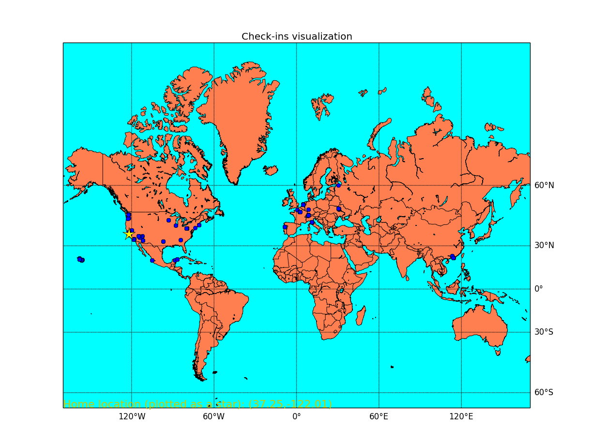

JourneyClassifier
=================
<html>
<head>
<h4 align="center">Visualize and classify your GPS shots</h4>
</head>

<body>

This project uses GPS points (check-ins) to classify them into groups by the same year and the same country. You can also visualize all your check-ins on the world map.

The input data from GPS should be formatted as
<table style="width:100%">
  <tr>
    <td>UniqueID</td>
    <td>UnixTime</td>		
    <td>Latitude</td>
    <td>Longitude</td>
  </tr>
</table> 
and stored in “checkins.csv”.

The output data (“checkins_upd.csv”) contains additional right column that represents group ID, classified by the same year and the same country in.

In case of being at home at least >70% of all time (the input observation should be taken during one or more years), more than half of GPS observations are found in the country, where the person lives and works. Thus, you can figure out the home localization (shown as a yellow star on the map).

All country boundaries have been taken from the <a href="http://www.diva-gis.org/Data">Free Spatial Data</a>. You should <a href="http://biogeo.ucdavis.edu/data/world/countries_shp.zip">download global country boundaries</a> and unzip the “countries.shp” in the project directory.

You must have Python2.7.x installed on your computer with the <b>obligatory packages</b> below to run the project. It was tested on Python2.7.8.

Obligatory Python packages (can be found at http://www.lfd.uci.edu/~gohlke/pythonlibs/):

<ul>
    <li><b>matplotlib</b> (with <b>pyparsing</b>, <b>dateutil</b>, <b>pytz</b> and <b>six</b>)</li>
	<li><b>basemap</b> toolkit to visualize data</li>
	<li><b>numpy</b></li>
	<li><b>scipy</b></li>
	<li><b>fiona</b> (with <b>GDAL</b>) to read a shapefile and get country boundaries
	<li><b>sklearn</b> to use k-means algorithm to determine home localization
</ul>
</body>
</html>
