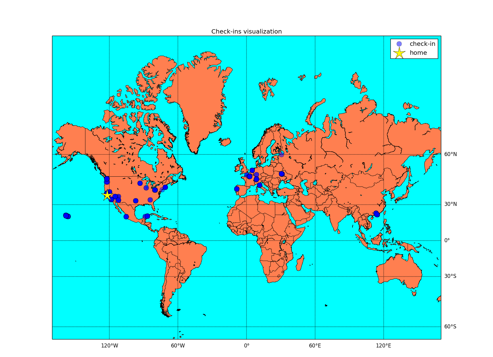

JourneyClassifier
=================
##### Visualize and classify your GPS shots

This project uses GPS points (check-ins) to classify them into groups by the same year and the same country. You can also visualize all your check-ins on the world map.
The input data from GPS should be formatted as

| UniqueID | UnixTime | Latitude  | Longitude |

and stored in `checkins.csv`.

The output data (`checkins_upd.csv`) contains additional right column that represents group ID, classified by the same year and the same country localization of the agent.

Being in home town at least 70% of all time (provided observation should be long-continued: one or more years), more than half of GPS observations are found in the country, where the person lives and works. Hence you can estimate home localization (shown as a yellow star on the map).

All country boundaries have been taken from the [Free Spatial Data](http://www.diva-gis.org/Data). You should [download global country boundaries](http://biogeo.ucdavis.edu/data/world/countries_shp.zip) and unzip all archieve files into project directory.

You must have Python 2.7.x or Python 3.x installed on your computer with the packages below to run the project.

**Obligatory Python packages** (can be found at [http://www.lfd.uci.edu/~gohlke/pythonlibs](http://www.lfd.uci.edu/~gohlke/pythonlibs/)):

1. matplotlib
2. numpy
3. [basemap](http://www.lfd.uci.edu/~gohlke/pythonlibs/#basemap) toolkit for data visualization
4. [fiona](http://www.lfd.uci.edu/~gohlke/pythonlibs/#fiona) (requires [GDAL](http://www.lfd.uci.edu/~gohlke/pythonlibs/#gdal)) to read shapefiles and get country boundaries
5. [scipy](http://sourceforge.net/projects/scipy/files/scipy/)
6. [scikit-learn](http://scikit-learn.org) to use k-means algorithm to determine home localization
